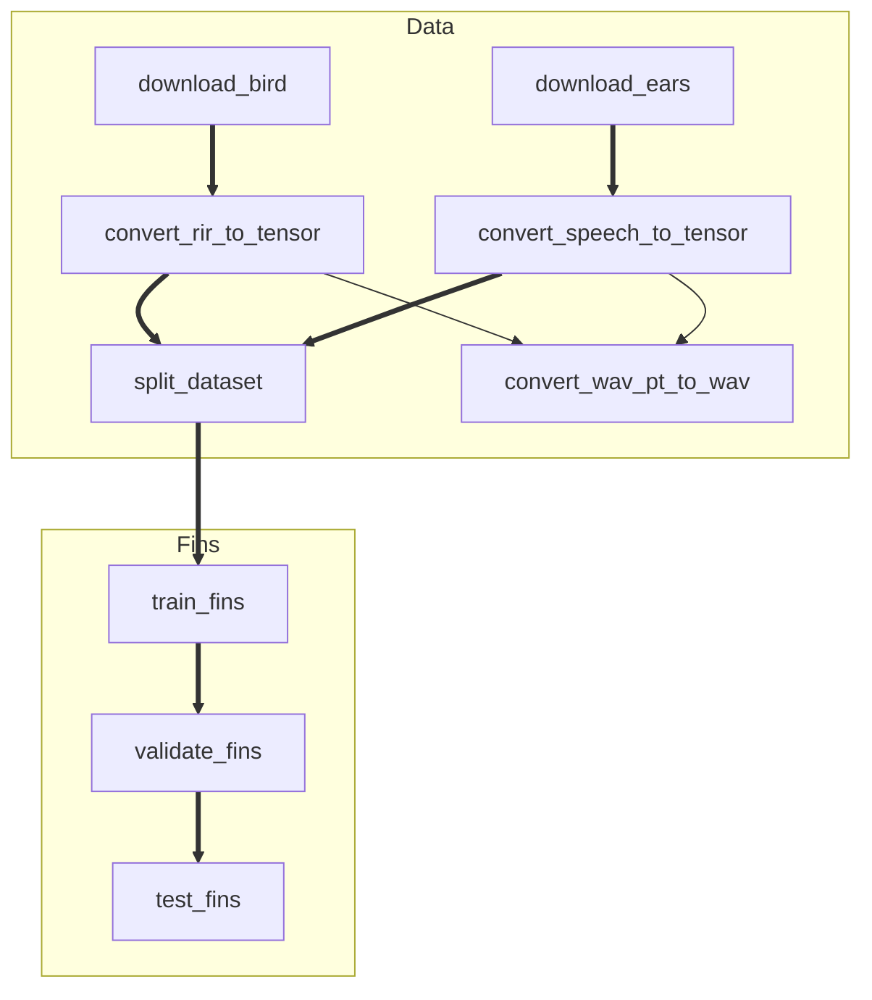

# Ricbe 基于深度学习的房间冲激响应逆卷积和盲估计

## 环境

我们在 Linux 上使用 Anaconda 进行环境管理。 CUDA 版本 12.4 。我们开发时使用 Visual Studio Code ，也强烈建议您继续使用它。

```shell
conda create -n Ricbe python=3.12.8
conda activate Ricbe
conda install ffmpeg=7.1.0
pip install torch==2.5.1
pip install -r other_requirements.txt
```

## 项目结构

为了更好地导入各模块，我们统一将 `src` 视为根目录进行 `import` 。运行脚本时，需要将 `PYTHONPATH` 设置到 `src` 处，否则模块可能导入失败。如果您使用 Visual Studio Code ，则不需要手动调整，因为我们配置好了 `python.envFile` 。但由于相对路径的使用，在终端中执行脚本时，请确保当前目录位于默认的 `Ricbe--RirBlindEstimation` 处。

我们在部分脚本的文件名中加入了 `_exe.py` ，以表示它是被设计为直接执行的：

```shell
python src/xxxxx_exe.py
```

其余的脚本则会被这些可执行脚本引用，以完成相应的任务。其中一部分也能够直接运行并获得一些输出，但这主要用于测试其自身功能是否正常。

除此之外，每个可执行脚本都会有与其对应的配置脚本 `_config.py` 来储存配置。使用脚本文件保存配置，可以允许一些更加复杂的配置项，也方便复用，并能够在代码中直接定位来源。如果使用 Visual Studio Code ，这些配置脚本会被嵌套在相应的可执行脚本下，而不是显示为一个独立的文件。

为了更好地维护相互间的执行顺序和依赖关系，这里列出一张顺序表：



## 数据集

### Rir 数据集

Bird： https://github.com/FrancoisGrondin/BIRD

可以使用 `download_bird_exe` 下载。

### 语音数据集

Ears： https://github.com/facebookresearch/ears_dataset

可以使用 `download_ears_exe` 下载。
