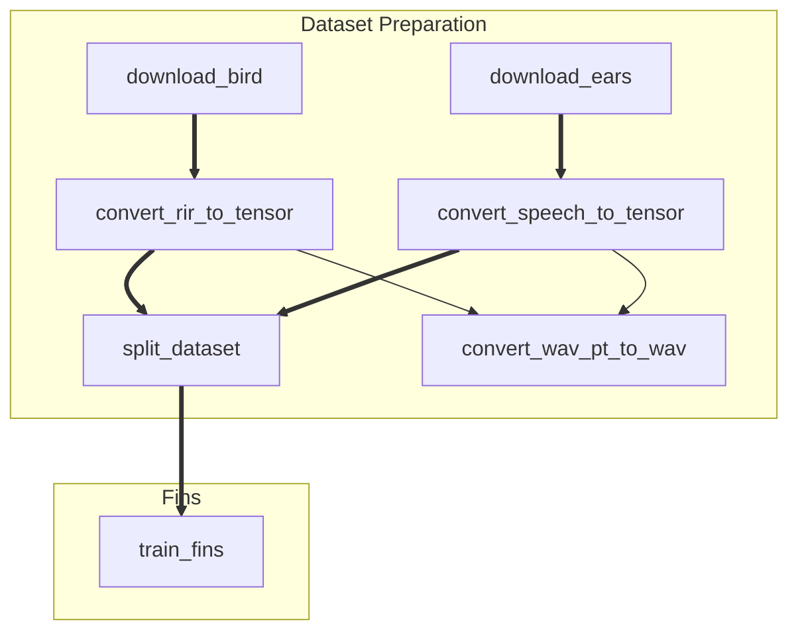

# Ricbe 基于深度学习的房间冲激响应逆卷积和盲估计

## 环境

我们在 Linux 上使用 Anaconda 进行环境管理。 CUDA 版本为 12.4 。

```shell
conda create -n Ricbe python=3.12.5
conda activate Ricbe
conda install ffmpeg=6.1.1
pip install torch==2.4.1 --index-url https://download.pytorch.org/whl/cu124
pip install -r other_requirements.txt
```

## 项目结构

所有代码均放在 `src` 文件夹下，但执行时一般把工作目录设置在 `Ricbe--RirBlindEstimation` 处，默认配置都是按照这个工作目录设置的。

其中以 `_exe.py` 结尾的文件是设计为可以直接执行的：

```shell
python src/xxxxx_exe.py
```

而 `_exe.py` 会有与其对应的 `_config.py` 来储存配置。是的，我们直接使用 python 脚本来保存配置。这允许我们设置一些更加复杂的配置项，也能方便地复用之前的配置，并在代码中定位其配置项的使用位置。

为了更好地维护相互间的执行顺序和依赖关系，这里列出一张顺序表：




## 数据集和预处理

### Rir 数据集

Bird： https://github.com/FrancoisGrondin/BIRD

可以使用 `download_bird_exe` 下载。

### 语音数据集

Ears： https://github.com/facebookresearch/ears_dataset

可以使用 `download_ears_exe` 下载：

### 预处理

#### 生成 wav.pt 文件

可以使用 `convert_rir_to_tensor_exe` 和 `convert_speech_to_tensor_exe` 生成 `.wav.pt` 文件。

#### 数据集切割

使用 `split_dataset_exe` 进行全局数据集切割。
